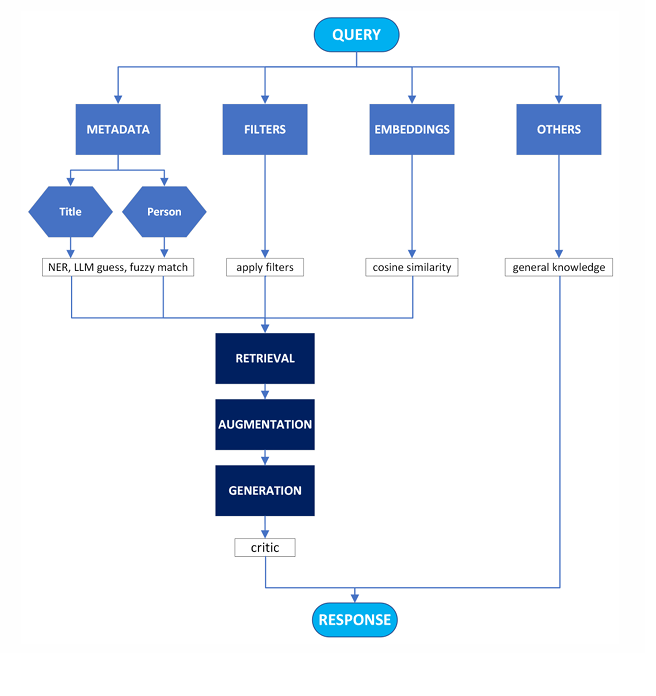

# Enhancing Large Language Models with Retrieval-Augmented Generation: A Case Study on Movie Data Beyond the Training Cutoff

### A research project using Llama 3.2 and Retrieval-Augmented Generation to answer questions about post-cutoff movie releases

---

## Project overview

This project investigates the effectiveness of Retrieval-Augmented Generation (RAG) in enhancing Large Language Models (LLMs) with up-to-date, domain-specific information. The Llama 3.2 (3B) model is utilized, enriched with metadata about over 14,000 movies released in 2024 - information not present in the model’s original training corpus. The movie data is stored in a structured JSON format, allowing for seamless integration with vector databases. Evaluation is conducted through manual accuracy assessment of the model's responses.


The system is designed to answer user questions about directors, actors, runtime, genres, themes, and other movie-related details by leveraging:
- **Metadata retrieval** for structured queries (title, genre, cast, etc.)
- **Semantic embedding search**, generated using `all-MiniLM-L6-v2`, for plot similarity or abstract theme queries
- **Query classification** that routes prompts to appropriate processing strategies (metadata / filter / embedding / others).
- **Response validation** using a second LLM as a critic

Below, the system workflow is shown:



Built on top of:
- **Llama 3.2 (via Ollama)** for generation
- **all-MiniLM-L6-v2** for semantic embeddings
- **ChromaDB** for vector storage and retrieval
- **LangChain** for prompt parsing

---

## Files descriptions

| File | Description |
|------|-------------|
| `main.py` | Entry-point CLI app for querying the assistant. |
| `create_chromaDB.py` | Loads movies from `movies_data.json`, computes plot embeddings, and stores everything in ChromaDB. |
| `config.py` | Initializes embedding model, LLMs, and connects to ChromaDB. |
| `parser.py` | Handles all LLM-powered query parsing: classification, metadata search type, and filtering extraction. |
| `utils.py` | Core search logic (metadata, filtering, embeddings), entity recognition (spaCy), fuzzy matching, and response validation using a "critic" LLM. |
| `test.py` | Script for bulk testing: generates random queries and logs model responses to CSV. |


---

## Requirements


### Python dependencies

To run the project locally, make sure you have the following:

- Python 3.10+
- `chromadb`
- `sentence-transformers`
- `langchain`
- `langchain_ollama`
- `langchain_huggingface`
- `spacy`
- `fuzzywuzzy`
- `pandas`
- `numpy`
- `scikit-learn`

Install them via:

```bash
pip install -r requirements.txt
```

Also download the transformer model for spaCy:
```bash
python -m spacy download en_core_web_trf
```

### Ollama (Local LLM Runtime)

This project uses [**Ollama**](https://ollama.com/) to run the **Llama 3.2** model locally — without any reliance on cloud APIs.

> **Ollama** is a lightweight runtime that allows you to run and interact with open-source LLMs such as LLaMA, Mistral, and Gemma directly on your machine. It simplifies model loading, serving, and integration with local applications.

#### 🚀 Installation

1. Visit the official download page:  
   👉 [https://ollama.com/download](https://ollama.com/download)

2. Download and install the appropriate version for your OS (macOS, Windows, or Linux).

3. Open your terminal and run:

```bash
ollama run llama3.2
```
---

## Running the Project

```bash
python main.py
```
Example queries:

* "Who directed The Substance?" (metadata/title)

* "In what movies did Pedro Pascal star?" (metadata/actor)

* "Give me 3 action movies with Rotten Tomatoes rating above 6" (filter)

* "I loved Gladiator II, recommend similar movies" (embeddings)

* "Tell me about current trends in sci-fi films" (others → base LLM)

---

## Testing and Evaluation

The `tests.py` script allows automated testing of the assistant by generating random queries across multiple categories and saving the responses to a CSV file. This is useful for evaluating the accuracy and behavior of the system across different types of prompts.

### 🔧 Configuration

Before running the script, set the following in `tests.py`:

```python
MODE = "titles"  # Options: "actors", "titles", "filter", "similarity", "embeddings"
SAMPLE_SIZE = 5  # Number of random queries to generate
```

Available MODE options:

| Mode        | Description                                                         |
|-------------|---------------------------------------------------------------------|
| `titles`    | Asks about movie metadata based on title (e.g. cast, genre, director)              |
| `actors`    | Queries based on actor names (e.g. "Movies with Tom Hardy")         |
| `filter`    | Queries with filters (e.g. genre, rating, runtime)                  |
| `similarity`| Asks for similar movies based on a title                            |
| `embeddings`| Abstract queries (e.g. "movies about AI", "films with robots")      |


### Run the script 
```python
python tests.py
```

---

## Additional Materials

The `/docs` folder contains supplementary files related to this project:

- `Article_Enhancing_LLMs_with_RAG.pdf` - A full scientific article describing the methodology, architecture, and evaluation results of this system.
- `Poster_Enhancing_Large_Language_Models_with_Retrieval-Augmented_Generation.pdf` - A scientific poster summarizing the key concepts and findings.

These resources provide further context for academic readers, reviewers, or anyone interested in the research aspects of the project.
